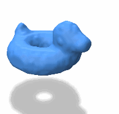

This software is for animating physically simulated elastoplastic amorphous objects. It was written by Michael Xu, and was used for our upcoming poster at Symposium of Computer Animation 2023. It uses polyscope (https://polyscope.run/) for visualization and GUI. 

**DiffMPMLib3D** is the main library for all differentiable MPM and optimization.

**DiffMPMAnimator3D** is the polyscope app for running the algorithms and visualizing data.

**PointCloudMesher** is another polyscope app which also creates meshes out of point clouds and outputs screenshots for animation.

_____
**Build Instructions**
I don't have an easy method of building this from scratch. It's probably best to generate a polyscope project first, then include the necessary projects: DiffMPMLib3D, DiffMPMAnimator3D, and/or PointCloudMesher. Also I have only tested this on Windows 10 with Visual Studio 2022.